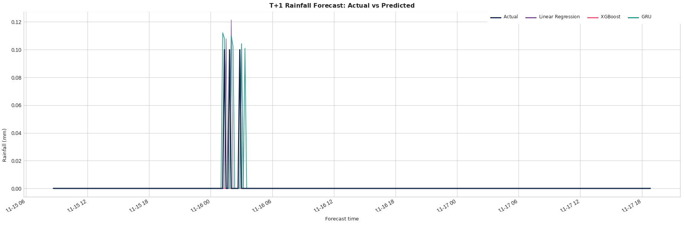
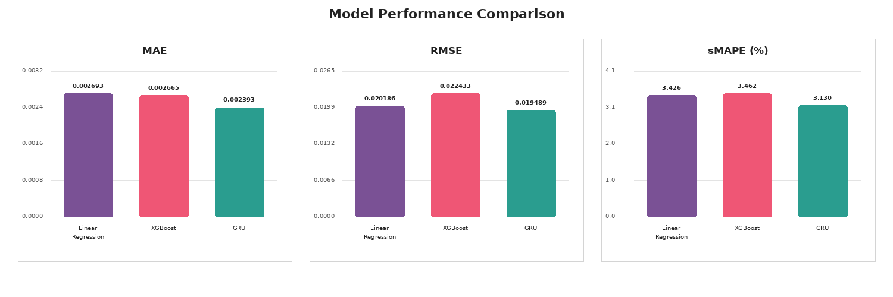

# Time Series Group 03

## 1. Tên nhóm và thành viên

**Tên repository:** `time-series-group-03`

**Tên nhóm:** Nhóm 03

**Thành viên:**

Đào Trung Hiếu 

Nguyễn Văn Hiệp    

Nguyễn Minh Huy 

## 2. Chủ đề nghiên cứu

Đề tài của nhóm là **dự báo lượng mưa từ dữ liệu thời tiết đa biến**.

Bài toán được xây dựng theo dạng:

[
X \in \mathbb{R}^{T \times d} \rightarrow y \in \mathbb{R}^{T}
]

Trong đó:

* (X): chuỗi thời gian nhiều chiều gồm các biến thời tiết.
* (d): số biến đầu vào.
* (y): biến mục tiêu một chiều.
* Biến mục tiêu của nhóm: **lượng mưa (`rain`)**.
* Mục tiêu dự báo: dùng dữ liệu tại các thời điểm trước đó để dự báo lượng mưa ở thời điểm tiếp theo.

Dạng input-output trong mô hình chuỗi:

[
X_{t-L+1:t} \in \mathbb{R}^{L \times d} \rightarrow y_{t+1} \in \mathbb{R}
]

Với bài thực nghiệm, nhóm sử dụng cửa sổ đầu vào gồm **144 bước thời gian**, tương ứng 24 giờ nếu dữ liệu có tần suất 10 phút.

## 3. Mô tả bộ dữ liệu

Nhóm sử dụng bộ dữ liệu thời tiết đa biến, gồm nhiều chỉ số khí tượng được ghi nhận theo thời gian.

Một số biến trong dữ liệu:

* `p`: áp suất khí quyển.
* `T`: nhiệt độ.
* `Tpot`: nhiệt độ tiềm năng.
* `Tdew`: điểm sương.
* `rh`: độ ẩm tương đối.
* `VPmax`, `VPact`, `VPdef`: các biến liên quan đến áp suất hơi nước.
* `sh`: độ ẩm riêng.
* `H2OC`: nồng độ hơi nước.
* `rho`: mật độ không khí.
* `wv`: vận tốc gió.
* `max. wv`: vận tốc gió lớn nhất.
* `wd`: hướng gió.
* `rain`: lượng mưa.
* `raining`: trạng thái có mưa.
* `SWDR`, `PAR`, `max. PAR`: các biến bức xạ.
* `Tlog`: biến nhiệt độ đã biến đổi log.

Thông tin dữ liệu:

* **Tần suất lấy mẫu:** 10 phút.
* **Biến mục tiêu:** `rain`.
* **Dạng bài toán:** chuỗi thời gian nhiều biến đầu vào, một biến đầu ra.
* **Tỷ lệ chia dữ liệu:**

  * Train: 70%
  * Validation: 15%
  * Test: 15%

Dữ liệu được đặt trong thư mục:

```text
data/
├── raw/
│   └── weather.csv
└── processed/
    ├── final_train.csv
    ├── final_val.csv
    └── final_test.csv
```

## 4. Ba bài báo đã đọc

Nhóm đọc và tóm tắt ba bài báo liên quan đến dự báo chuỗi thời gian nhiều chiều.

### 4.1. Paper 01: CA-DE

**Tên bài báo:** CA-DE: Heterogeneous Component-Aware and Antagonistic Dependency-Enhanced Dual Paths for Long-Term Time Series Forecasting

**Năm:** 2026

**Ý tưởng chính:**

Bài báo đề xuất mô hình CA-DE với hai nhánh xử lý song song:

* Nhánh học đặc trưng thành phần thời gian như xu hướng và mùa vụ.
* Nhánh học quan hệ phụ thuộc giữa các biến, bao gồm cả tương quan thuận và tương quan nghịch.

**Điểm đáng chú ý:**

Mô hình cố gắng tách riêng đặc trưng thời gian và quan hệ giữa các biến, từ đó giảm sự trộn lẫn thông tin trong không gian đặc trưng.

**Khả năng áp dụng:**

Có thể áp dụng cho dữ liệu thời tiết đa biến vì các biến khí tượng thường có quan hệ phụ thuộc lẫn nhau, ví dụ nhiệt độ, độ ẩm, áp suất và lượng mưa.

### 4.2. Paper 02: TimeXer

**Tên bài báo:** TimeXer: Empowering Transformers for Time Series Forecasting with Exogenous Variables

**Năm:** 2024

**Ý tưởng chính:**

TimeXer phân biệt rõ:

* Biến nội sinh: biến mục tiêu cần dự báo.
* Biến ngoại sinh: các biến hỗ trợ dự báo.

Mô hình sử dụng patch token, global token và variate token để học quan hệ giữa biến mục tiêu và các biến ngoại sinh.

**Điểm đáng chú ý:**

TimeXer rất phù hợp với bài toán của nhóm vì nhóm dự báo một biến mục tiêu `rain` từ nhiều biến thời tiết đầu vào.

**Khả năng áp dụng:**

Trong bài toán của nhóm:

* `rain` là biến mục tiêu.
* Các biến như nhiệt độ, độ ẩm, áp suất, gió và bức xạ là biến ngoại sinh.

### 4.3. Paper 03: MCMamba

**Tên bài báo:** MCMamba: A Multi-Scale Correlation-Aware Model with Mamba for Stock Price Forecasting

**Năm:** 2026

**Ý tưởng chính:**

MCMamba kết hợp:

* Mamba để xử lý chuỗi dài.
* Mô hình hóa đa tỷ lệ.
* Ma trận tương quan để học quan hệ giữa các chuỗi.

**Điểm đáng chú ý:**

Bài báo tập trung vào dự báo tài chính, nhưng ý tưởng học quan hệ đa biến và nhiều thang thời gian có thể tham khảo cho chuỗi thời tiết.

**Khả năng áp dụng:**

Không phù hợp trực tiếp bằng TimeXer vì MCMamba được thiết kế cho dữ liệu cổ phiếu. Tuy nhiên, ý tưởng mô hình hóa đa tỷ lệ vẫn có giá trị tham khảo.

Các bản tóm tắt chi tiết được đặt trong thư mục:

```text
papers/
├── paper_01.md
├── paper_02.md
└── paper_03.md
```

## 5. Phương pháp thực hiện

Quy trình thực hiện gồm bốn bước chính.

### 5.1. Khám phá dữ liệu

Notebook:

```text
notebooks/01_data_exploration.ipynb
```

Nội dung:

* Đọc dữ liệu gốc.
* Kiểm tra số dòng, số cột.
* Kiểm tra kiểu dữ liệu.
* Kiểm tra missing values.
* Kiểm tra dữ liệu có lấy mẫu đều theo thời gian không.
* Khảo sát phân phối lượng mưa.
* Vẽ biểu đồ lượng mưa theo thời gian.
* Vẽ ma trận tương quan giữa các biến.

### 5.2. Tiền xử lý và tạo đặc trưng

Notebook:

```text
notebooks/02_feature_engineering.ipynb
```

Các bước tiền xử lý:

1. Chuyển cột thời gian về dạng `datetime`.
2. Sắp xếp dữ liệu theo thời gian.
3. Xóa các mốc thời gian trùng lặp.
4. Resample dữ liệu về tần suất 10 phút.
5. Nội suy missing values theo thời gian.
6. Xử lý outlier bằng phương pháp IQR.
7. Tạo đặc trưng thời gian:

   * `hour`
   * `day_of_week`
   * `month`
   * `is_weekend`
8. Tạo đặc trưng Fourier:

   * `sin_day`
   * `cos_day`
   * `sin_week`
   * `cos_week`
   * `sin_year`
   * `cos_year`
9. Chuẩn hóa dữ liệu bằng `StandardScaler`.
10. Chia train/validation/test theo thứ tự thời gian.

### 5.3. Xây dựng mô hình

Notebook:

```text
notebooks/03_models.ipynb
```

Nhóm xây dựng ba mô hình:

#### Mô hình 1: Linear Regression

Đây là mô hình baseline.

Mục đích:

* Làm mốc so sánh cơ bản.
* Kiểm tra khả năng dự báo bằng quan hệ tuyến tính giữa các biến đầu vào và lượng mưa.

#### Mô hình 2: XGBoost

XGBoost là mô hình học máy mạnh cho dữ liệu dạng bảng.

Mục đích:

* Học quan hệ phi tuyến giữa các biến thời tiết và lượng mưa.
* Tận dụng các đặc trưng thời gian và Fourier đã tạo.

#### Mô hình 3: GRU

GRU là mô hình mạng nơ-ron hồi tiếp dùng cho chuỗi thời gian.

Mục đích:

* Học phụ thuộc theo thời gian trong cửa sổ đầu vào.
* Sử dụng chuỗi nhiều bước trước đó để dự báo lượng mưa tại thời điểm tiếp theo.

### 5.4. Đánh giá mô hình

Notebook:

```text
notebooks/04_evaluation.ipynb
```

Các chỉ số đánh giá:

* MAE
* RMSE
* sMAPE

Ngoài ra, nhóm có tính thêm:

* MSE
* R2
* Rain Precision
* Rain Recall
* Rain F1

Các hình được lưu trong:

```text
figures/
├── y_true_vs_y_pred.png
└── model_metrics_comparison.png
```

Kết quả được lưu trong:

```text
results/
└── metrics.csv
```

## 6. Bảng kết quả mô hình

| Mô hình           |      MAE |     RMSE | sMAPE (%) |       R2 |
| ----------------- | -------: | -------: | --------: | -------: |
| Linear Regression | 0.002693 | 0.020186 |  3.426139 | 0.410617 |
| XGBoost           | 0.002665 | 0.022433 |  3.461736 | 0.272082 |
| GRU               | 0.002393 | 0.019489 |  3.129758 | 0.450607 |

Theo kết quả thực nghiệm, **GRU đạt kết quả tốt nhất** trên cả ba chỉ số chính:

* MAE thấp nhất.
* RMSE thấp nhất.
* sMAPE thấp nhất.

## 7. Hình kết quả

### 7.1. So sánh y_true và y_pred



### 7.2. So sánh chỉ số mô hình



## 8. Cấu trúc repository

```text
time-series-group-03/
├── README.md
├── papers/
│   ├── paper_01.md
│   ├── paper_02.md
│   └── paper_03.md
├── data/
│   ├── raw/
│   └── processed/
├── notebooks/
│   ├── 01_data_exploration.ipynb
│   ├── 02_feature_engineering.ipynb
│   ├── 03_models.ipynb
│   └── 04_evaluation.ipynb
├── src/
│   ├── data_loader.py
│   ├── features.py
│   ├── models.py
│   └── evaluation.py
├── figures/
│   ├── y_true_vs_y_pred.png
│   └── model_metrics_comparison.png
├── results/
│   └── metrics.csv
├── report/
│   └── final_report.md
├── requirements.txt
└── .gitignore
```

## 9. Cách chạy code

### 9.1. Cài đặt thư viện

Clone repository:

```bash
git clone https://github.com/<username>/time-series-group-03.git
cd time-series-group-03
```

Cài đặt thư viện:

```bash
pip install -r requirements.txt
```

### 9.2. Chuẩn bị dữ liệu

Đặt file dữ liệu gốc vào:

```text
data/raw/weather.csv
```

### 9.3. Chạy notebook theo thứ tự

Chạy lần lượt:

```text
notebooks/01_data_exploration.ipynb
notebooks/02_feature_engineering.ipynb
notebooks/03_models.ipynb
notebooks/04_evaluation.ipynb
```

Sau khi chạy xong:

* Dữ liệu đã xử lý nằm trong `data/processed/`.
* Kết quả đánh giá nằm trong `results/metrics.csv`.
* Hình ảnh kết quả nằm trong `figures/`.

## 10. Kết luận

Nhóm đã xây dựng bài toán dự báo lượng mưa từ chuỗi thời gian thời tiết đa biến. Dữ liệu được tiền xử lý theo đúng quy trình gồm kiểm tra missing values, làm đều thời gian, xử lý outlier, tạo đặc trưng thời gian, tạo đặc trưng Fourier, chuẩn hóa và chia tập theo thứ tự thời gian.

Nhóm đã đọc và tóm tắt ba bài báo mới về chuỗi thời gian, trong đó TimeXer là bài báo phù hợp nhất với bài toán của nhóm vì mô hình tập trung vào dự báo một biến mục tiêu với nhiều biến ngoại sinh.

Về thực nghiệm, nhóm xây dựng ba mô hình gồm Linear Regression, XGBoost và GRU. Kết quả cho thấy GRU đạt hiệu quả tốt nhất với:

* MAE = 0.002393
* RMSE = 0.019489
* sMAPE = 3.129758%

Điều này cho thấy việc sử dụng mô hình chuỗi thời gian có khả năng học phụ thuộc theo thời gian giúp cải thiện kết quả dự báo lượng mưa so với các mô hình dạng bảng.

## 11. Hạn chế và hướng phát triển

Một số hạn chế:

* Dữ liệu lượng mưa có nhiều giá trị bằng 0, gây mất cân bằng giữa thời điểm mưa và không mưa.
* Các đợt mưa lớn hoặc đột biến vẫn khó dự báo chính xác.
* GRU tốt hơn các mô hình còn lại nhưng vẫn là mô hình tương đối cơ bản so với các kiến trúc mới như TimeXer hoặc TimeMixer.

Hướng phát triển:

* Thử nghiệm TimeXer để tận dụng rõ hơn quan hệ giữa biến mục tiêu và biến ngoại sinh.
* Thử nghiệm TimeMixer hoặc iTransformer.
* Bổ sung kỹ thuật xử lý mất cân bằng cho các thời điểm có mưa.
* Dự báo nhiều bước thời gian thay vì chỉ dự báo T+1.
* So sánh thêm với các mô hình chuyên sâu khác như LSTM, Transformer hoặc Mamba.
