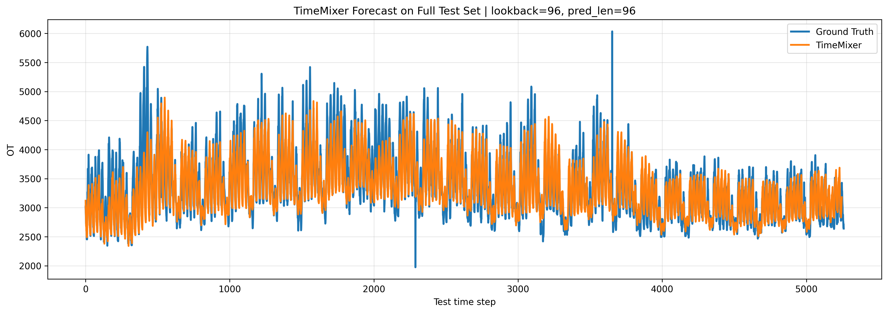
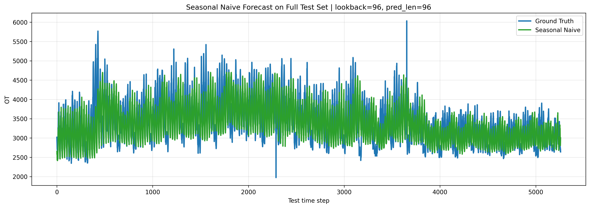
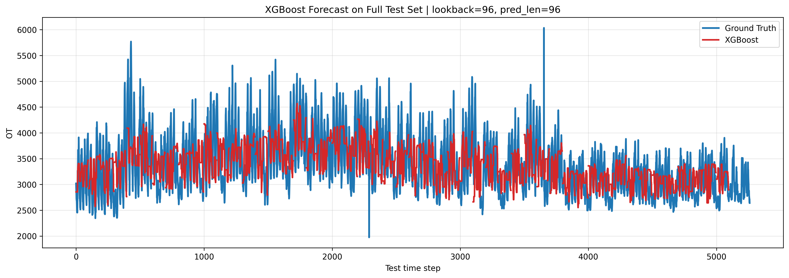

# Báo cáo tóm tắt: TimeMixer cho dự báo phụ tải điện

## 1. Mục tiêu

Báo cáo trình bày việc áp dụng mô hình TimeMixer cho bài toán dự báo chuỗi thời gian dài hạn trên bộ dữ liệu Electricity. Mục tiêu là so sánh TimeMixer với hai baseline là Seasonal Naive và XGBoost.

## 2. Dữ liệu

Dữ liệu Electricity gồm 321 kênh phụ tải điện, được ghi nhận theo tần suất 1 giờ. Thiết lập chính sử dụng cửa sổ quan sát `lookback = 96` và các tầm dự báo `96`, `192`, `336`, `720`.

## 3. Mô hình

- **Seasonal Naive:** baseline thống kê dựa trên tính lặp mùa vụ.
- **XGBoost:** baseline học máy truyền thống dùng đặc trưng trễ.
- **TimeMixer:** mô hình chính, học biểu diễn đa quy mô bằng cơ chế decomposable multiscale mixing.

## 4. Kết quả

Kết quả chi tiết được lưu tại `results/metrics.csv`. TimeMixer đạt MSE thấp nhất ở cả bốn horizon.

| Model | Horizon | MSE | MAE | RMSE |
|---|---:|---:|---:|---:|
| TimeMixer | 96 | 0.1526 | 0.2449 | 0.3906 |
| TimeMixer | 192 | 0.1656 | 0.2567 | 0.4069 |
| TimeMixer | 336 | 0.1854 | 0.2749 | 0.4306 |
| TimeMixer | 720 | 0.2236 | 0.3119 | 0.4729 |

## 5. Kết luận

TimeMixer cho kết quả tốt hơn Seasonal Naive và XGBoost vì mô hình có khả năng học đồng thời dao động ngắn hạn và xu hướng dài hạn. Với dữ liệu Electricity có tính mùa vụ mạnh, cơ chế trộn đa quy mô giúp TimeMixer giữ nhịp dao động tốt hơn, đồng thời giảm sai số ở horizon dài.

## Bổ sung dữ liệu sau khi chia tập

Dữ liệu `electricity.csv` đã được chia theo thứ tự thời gian thành ba tập:

| Split | Số dòng | Tỷ lệ |
|---|---:|---:|
| Train | 18412 | 70% |
| Validation | 2632 | 10% |
| Test | 5260 | 20% |

Các file được lưu trong `data/processed/`. Việc chuẩn hóa được thực hiện bằng cách fit scaler trên tập train, sau đó áp dụng cho validation/test để tránh rò rỉ dữ liệu.

## Hình trực quan trong báo cáo

Thư mục `figures/` chỉ giữ các hình được chèn trực tiếp trong báo cáo sau khi chạy thí nghiệm.

### TimeMixer

### Seasonal Naive

### XGBoost

